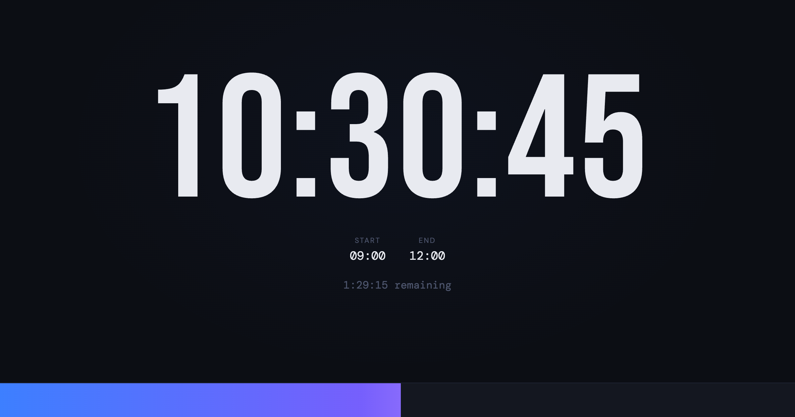

# Exam Clock



A single-file, zero-build exam timer. Enter start and end times to get a live countdown, animated progress bar, and automatic overtime tracking.

**Live:** https://sebiglesias.com.ar/exam-clock

## Features

- **Live countdown** — shows time remaining, updates every second
- **Animated progress bar** — fills from left to right across the exam window
- **Overtime tracking** — bar turns red and counts up once time is up
- **Pre-exam countdown** — shows "Starts in X" if the clock is opened early
- **URL parameters** — share or bookmark a pre-configured clock directly
- **Dark / Light / System theme** — persisted in `localStorage`, no flash on load
- **No build step** — a single `index.html` with inlined CSS and JS

## Usage

### Manual setup

Open `index.html` in a browser, enter the start and end times, and click **Start Exam Clock**.

### URL parameters

Skip the setup screen by passing `start` and `end` as query params:

```
index.html?start=09:00&end=11:30
```

Both values must be `HH:MM` (24-hour format). This is useful for projectors or shared links where the invigilator sets the URL once.

## Project structure

```
exam-clock/
├── index.html      # entire app — HTML, CSS, and JS in one file
├── favicon.svg
├── og-image.png    # Open Graph / social preview image
└── sitemap.xml
```

## Deployment

No server required — drop the files anywhere that serves static HTML. The canonical URL is set in `index.html`; update the `<link rel="canonical">` and OG/JSON-LD URLs if you self-host at a different path.

## Development

No dependencies to install. Edit `index.html` directly and open it in a browser (or use any static file server):

```sh
npx serve .
# or
python3 -m http.server
```
